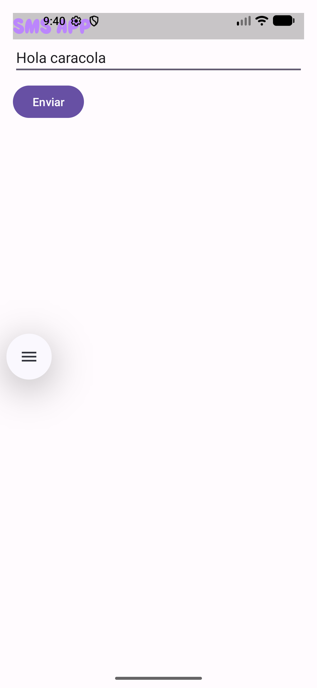
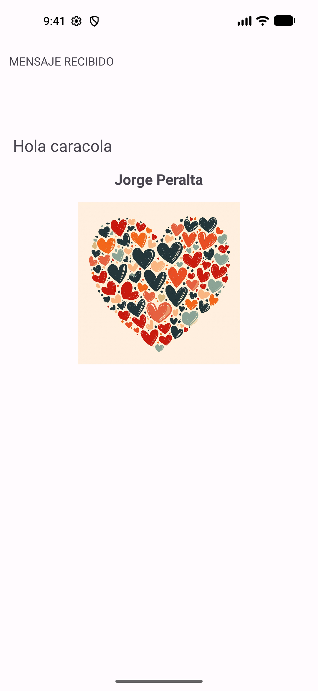
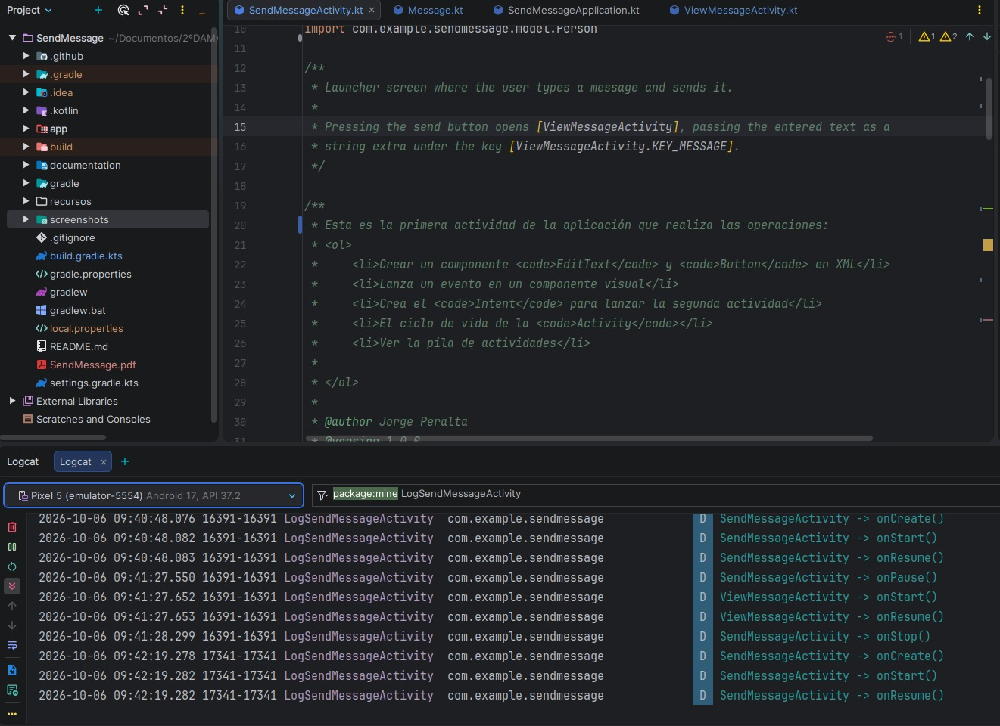
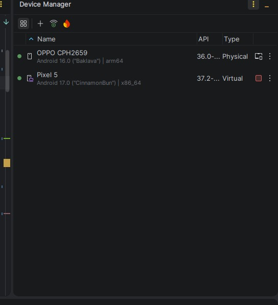

# SendMessage

> App para Android en Kotlin para aprender a pasar datos entre dos `Activity`: escribes un mensaje en una pantalla y lo ves recibido en la otra.


<table>
  <tr>
    <td align="center"></td>
    <td align="center"></td>
  </tr>
  <tr>
    <td align="center"><b>Pantalla de envío</b> (<code>SendMessageActivity</code>)</td>
    <td align="center"><b>Pantalla de recepción</b> (<code>ViewMessageActivity</code>)</td>
  </tr>
</table>

## ¿Por qué este proyecto?

Es un ejercicio didáctico pequeño. Cubre lo básico de una app Android con vistas XML en un código fácil de leer:

- Crear un `Intent` explícito para abrir una segunda `Activity`.
- Mandar un objeto entero (`Message`, que es `Parcelable`) dentro de un `Bundle`, en vez de pasar los datos uno a uno.
- Ver el ciclo de vida de una `Activity` en Logcat.

## Funcionalidades

- **Pantalla de envío** (`SendMessageActivity`, la que se abre al lanzar la app): un campo de texto y un botón **Enviar**.
- **Pantalla de recepción** (`ViewMessageActivity`): muestra «MENSAJE RECIBIDO», el texto que se envió, el nombre del remitente y una imagen. Usa edge-to-edge con ajuste a las barras del sistema.
- **Modelo de datos**: `Message(id, content, sender, receiver)` y `Person(dni, name, surname)`, los dos `Parcelable` gracias a `@Parcelize`.
- **Logs del ciclo de vida**: las dos actividades escriben en Logcat con la etiqueta `LogSendMessageActivity`.
- **Fuentes propias**: Super Waffles y Bitcount.
- **Documentación generada con Dokka**, en formato HTML y Javadoc.

## Inicio rápido

```bash
git clone https://github.com/jpersan07/SendMessageKotlin.git
cd SendMessageKotlin
./gradlew installDebug   # con un emulador o un dispositivo conectado
```

También puedes abrir la carpeta en Android Studio y ejecutar la configuración `app`.

**Resultado esperado:** se abre la pantalla «SMS APP». Escribe un texto y pulsa **Enviar**. En la segunda pantalla aparecen tu mensaje y el remitente («Jorge Peralta»).

## Cómo funciona

`SendMessageActivity.sendMessage()` crea un `Message` y lo mete en un `Bundle` junto con el nombre del remitente:

```kotlin
val message = Message(1, etMessageText.text.toString(), sender, receiver)
bundle.putParcelable(ViewMessageActivity.KEY_MESSAGE, message)
bundle.putString(ViewMessageActivity.KEY_SENDER, "${sender.name} ${sender.surname}")
intent.putExtras(bundle)
startActivity(intent)
```

`ViewMessageActivity` lo recupera en `onCreate()`:

```kotlin
val message = IntentCompat.getParcelableExtra(intent, KEY_MESSAGE, Message::class.java)
tvMessage.text = message?.content
tvSender.text = intent.getStringExtra(KEY_SENDER)
```

> Las personas remitente y destinataria están escritas a mano en el código (`Person("12345678A", "Jorge", "Peralta")`). La app no envía SMS reales ni necesita permisos.

### Decisiones de diseño

- **`Parcelable` en vez de `Serializable`.** `Parcelable` es el mecanismo nativo de Android para pasar objetos entre componentes y es más rápido que `Serializable`, que usa reflexión. El plugin `kotlin-parcelize` genera el código con una sola anotación (`@Parcelize`), así que las clases del modelo se quedan igual de cortas.
- **`IntentCompat.getParcelableExtra()`** para leer el extra. `Intent.getParcelableExtra(String)` está obsoleto desde Android 13, y la versión con tipo solo existe a partir de esa API. `IntentCompat` elige la llamada correcta según la versión del dispositivo.
- **Un objeto en vez de varios extras.** Se manda el `Message` entero en lugar de pasar el texto, el remitente y el destinatario por separado. Si el modelo crece, no hay que tocar el código que envía y recibe.
- **Constantes para las claves.** `KEY_MESSAGE` y `KEY_SENDER` están en el `companion object` de `ViewMessageActivity`, la actividad que las lee, para que las dos pantallas usen exactamente la misma clave.
- **Recursos fuera del código.** Los textos, colores y tamaños están en `strings.xml`, `colors.xml` y `dimens.xml`.

## Depuración

### Ciclo de vida en Logcat

Cada método del ciclo de vida escribe un mensaje con `Log.d(TAG, ...)`. Los métodos están agrupados en una `//region Ciclo de vida de una Actividad` para poder plegarlos en el IDE. Para verlos, filtra Logcat por `LogSendMessageActivity` y navega entre las dos pantallas.



En la captura se ve el orden real de los eventos:

1. Al abrir la app: `SendMessageActivity` → `onCreate()`, `onStart()`, `onResume()`.
2. Al pulsar **Enviar**: `SendMessageActivity` → `onPause()`. Después `ViewMessageActivity` → `onStart()`, `onResume()`. Solo cuando la segunda pantalla ya está visible, `SendMessageActivity` → `onStop()`.
3. Al relanzar la app (nuevo proceso, PID distinto), `SendMessageActivity` vuelve a pasar por `onCreate()`, `onStart()` y `onResume()`.

### Dispositivos

Las capturas se hicieron en un emulador **Pixel 5** (Android 17, API 37.2). En el Device Manager también aparece conectado un móvil físico **OPPO CPH2659** (Android 16). Para comprobar la conexión por ADB:

```bash
adb devices -l   # los dispositivos conectados aparecen con estado "device"
adb shell        # abre una consola dentro del dispositivo
```



## Requisitos e instalación

- Android Studio reciente, compatible con AGP 9.4.1
- Android SDK 37 (`compileSdk` y `targetSdk`)
- Un dispositivo o emulador con Android 7.0 o superior (API 24 o más)

Comandos útiles:

```bash
./gradlew assembleDebug          # genera el APK de depuración
./gradlew test                   # tests unitarios locales
./gradlew connectedAndroidTest   # tests instrumentados (necesitan un dispositivo)
./gradlew dokkaGenerate          # regenera la documentación en documentation/
```

## Estructura del proyecto

```
SendMessage/
├── app/src/main/
│   ├── java/com/example/sendmessage/
│   │   ├── SendMessageActivity.kt     # pantalla de envío (launcher)
│   │   ├── ViewMessageActivity.kt     # pantalla de recepción
│   │   ├── SendMessageApplication.kt
│   │   └── model/                     # Message y Person (Parcelable)
│   ├── res/                           # layouts, fuentes, drawables, strings, colores, dimensiones
│   └── AndroidManifest.xml
├── documentation/                     # documentación generada (html/ y javadoc/)
├── recursos/                          # recursos originales (fuentes, imágenes, SVG)
├── screenshots/                       # capturas usadas en este README
└── gradle/libs.versions.toml          # catálogo de versiones (incluye Dokka y Parcelize)
```

## Documentación

La referencia de la API ya está generada en el repo:

- HTML: [`documentation/html/index.html`](documentation/html/index.html)
- Javadoc: [`documentation/javadoc/index.html`](documentation/javadoc/index.html)

Documentación oficial de Android Developers relacionada con el proyecto:

- [Intents y filtros de intents](https://developer.android.com/guide/components/intents-filters)
- [El ciclo de vida de una actividad](https://developer.android.com/guide/components/activities/activity-lifecycle)
- [Generador de implementación Parcelable (`@Parcelize`)](https://developer.android.com/kotlin/parcelize)
- [Cómo ver registros con Logcat](https://developer.android.com/studio/debug/logcat)
- [Android Debug Bridge (ADB)](https://developer.android.com/tools/adb)
- [Documentar código Kotlin con KDoc y Dokka](https://kotlinlang.org/docs/kotlin-doc.html)

## Tecnologías

Kotlin · Kotlin Parcelize · AppCompat · ConstraintLayout · Material Components · Core/Activity KTX · Dokka 2.2.0 · JUnit 4 · Espresso

## Contribuir

Es un proyecto de aprendizaje, pero las sugerencias son bienvenidas. Abre un *issue* o un *pull request* en [GitHub](https://github.com/jpersan07/SendMessageKotlin).

## Autor

Jorge Peralta

## Licencia

Todavía no tiene licencia. Mientras no se añada un archivo `LICENSE`, se aplican los derechos de autor por defecto.
